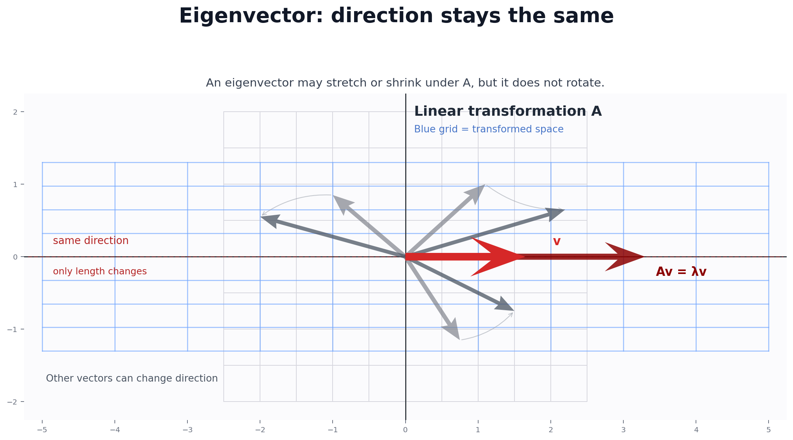

# Eigenvalues & Eigenvectors — Interview Knowledge Sheet

## Intuition

An **eigenvector** is a direction a matrix does not turn — it only stretches or shrinks it. The **eigenvalue** is how much it stretches by.

---

## 1. The Definition

For a square matrix `A`:

```
A v = λ v
```

- `v` — the **eigenvector** (a non-zero vector). Its direction stays the same after `A` acts on it.
- `λ` (lambda) — the **eigenvalue**. A single number: the scale factor.

In words: multiplying `v` by the matrix `A` gives back the *same* `v`, just scaled by `λ`.



The red vector is an eigenvector. After the matrix acts on it, it stays on the same line. Only its length changes.

```
A = [[2, 0],       v = [0,      A v = [0,      = 3 * [0,
     [0, 3]]            1]            3]              1]   → λ = 3
```

Here `v = [0, 1]` is an eigenvector with eigenvalue `3`.

---

## 2. Geometric Meaning

Most vectors get rotated *and* stretched when you multiply by a matrix. Eigenvectors are special: they only get **stretched** (or flipped/shrunk), never rotated.

```
random vector u:   A turns it to a new direction
eigenvector   v:   A keeps its direction, just changes its length by λ
```

- `λ > 1` → stretch longer
- `0 < λ < 1` → shrink
- `λ < 0` → flip to the opposite direction
- `λ = 0` → collapse to zero (matrix is singular in that direction)

An `n × n` matrix has up to `n` eigenvalues.

---

## 3. Characteristic Equation

How do you find the eigenvalues? Rewrite `A v = λ v` as:

```
A v − λ v = 0
(A − λI) v = 0
```

`I` is the identity matrix. For a non-zero `v` to exist, `(A − λI)` must be **singular** — its determinant is zero:

```
det(A − λI) = 0
```

This is the **characteristic equation**. Solve it for `λ`.

### 2×2 worked example

```
A = [[a, b],
     [c, d]]

A − λI = [[a − λ,  b    ],
          [c,      d − λ]]

det = (a − λ)(d − λ) − b·c = 0
    = λ² − (a + d)λ + (a·d − b·c) = 0
```

That is a quadratic in `λ`. Note:
- `a + d` is the **trace** (sum of the diagonal).
- `a·d − b·c` is the **determinant** of `A`.

So the equation is:

```
λ² − trace·λ + det = 0
```

Solve with the quadratic formula:

```
λ = ( trace ± √(trace² − 4·det) ) / 2
```

Example: `A = [[2, 1], [1, 2]]` → trace = 4, det = 3.

```
λ = (4 ± √(16 − 12)) / 2 = (4 ± 2) / 2 → λ = 3 or λ = 1
```

Once you have `λ`, plug it back into `(A − λI)v = 0` to find `v`.

---

## 4. Why AI Cares

- **PCA (Principal Component Analysis)**: the eigenvectors of the data's covariance matrix are the **principal directions** — the axes with the most spread. Their eigenvalues say how much variance each axis holds. You keep the top few to reduce dimensions.
- **Stability**: eigenvalues of a system's matrix tell you if it grows or settles (e.g. do gradients explode?).
- **Spectral methods**: graph clustering and embeddings use eigenvectors of graph matrices.
- **PageRank**: the ranking vector is the dominant eigenvector of the link matrix.

---

## 5. Power Iteration — finding the dominant eigenvector

You don't always need fancy math. The **dominant** eigenvector (largest `|λ|`) is easy to find:

1. Start with any random vector `v`.
2. Multiply by `A`. Normalize (divide by its length).
3. Repeat. `v` slowly turns toward the dominant eigenvector.
4. Get the eigenvalue with the **Rayleigh quotient**: `λ = (vᵀ A v) / (vᵀ v)`.

Why it works: each multiply amplifies the biggest-eigenvalue direction the most, so it takes over.

```
v₀ → A v₀ → normalize → A v₁ → normalize → ... → dominant eigenvector
```

This is the core idea behind PageRank.

---

## 6. From Scratch in Pure Python

```python
def dot(a, b):
    return sum(x * y for x, y in zip(a, b))

def matvec(A, v):
    return [dot(row, v) for row in A]

def l2(v):
    return sum(x * x for x in v) ** 0.5

def power_iteration(A, iters=100):
    # start vector, all ones
    v = [1.0] * len(A)
    for _ in range(iters):
        Av = matvec(A, v)
        n = l2(Av)
        v = [x / n for x in Av]          # normalize → keep length 1
    Av = matvec(A, v)
    lam = dot(v, Av)                      # Rayleigh quotient (v is unit length)
    return lam, v

def eig_2x2(A):
    a, b = A[0]
    c, d = A[1]
    trace = a + d
    det = a * d - b * c
    disc = (trace * trace - 4 * det) ** 0.5   # sqrt of discriminant
    return [(trace + disc) / 2, (trace - disc) / 2]
```

`power_iteration` gives the biggest eigenvalue and its direction. `eig_2x2` solves the quadratic directly for the exact two eigenvalues.

---

## 7. NumPy

```python
import numpy as np

A = np.array([[2.0, 1.0],
              [1.0, 2.0]])

# eigenvalues only
np.linalg.eigvals(A)            # array([3., 1.])

# eigenvalues AND eigenvectors
vals, vecs = np.linalg.eig(A)
# vals[i] is an eigenvalue
# vecs[:, i] is its eigenvector (a COLUMN, already unit length)

# check the defining property A v = λ v
i = 0
np.allclose(A @ vecs[:, i], vals[i] * vecs[:, i])   # True

# for a symmetric matrix, use eigh — faster, real results, sorted
vals, vecs = np.linalg.eigh(A)
```

Key detail: eigenvectors are the **columns** of `vecs`, not the rows.

---

## 8. PyTorch

```python
import torch

A = torch.tensor([[2.0, 1.0],
                  [1.0, 2.0]])

# eigenvalues only
torch.linalg.eigvals(A)         # complex tensor

# eigenvalues and eigenvectors
vals, vecs = torch.linalg.eig(A)
# results are COMPLEX dtype even for real matrices — take .real if you
# know the eigenvalues are real
vals.real

# for symmetric / Hermitian matrices use eigh — real output, sorted
vals, vecs = torch.linalg.eigh(A)
```

Watch out: `torch.linalg.eig` returns **complex** tensors. Use `.real` when the matrix is symmetric and you expect real numbers, or use `eigh` for symmetric matrices.

---

## 9. Complexity

| Operation | Cost |
|-----------|------|
| Power iteration (one step) | O(n²) — a matrix-vector multiply |
| Power iteration (total) | O(n² · iterations) |
| Full eigen-decomposition (`eig`) | O(n³) |
| 2×2 by formula | O(1) |

Full decomposition is `O(n³)` — the same ballpark as matrix multiply. Power iteration is cheaper when you only need the top eigenvector.

---

## 10. Interview Gotchas

| Trap | Fix |
|------|-----|
| Comparing eigenvectors directly | Sign and scale are ambiguous: `v` and `−v` are both valid. Check `A v ≈ λ v` instead. |
| Assuming eigenvalues come sorted | `np.linalg.eig` returns them in no fixed order. Sort before comparing. |
| Eigenvectors are rows | No — they are the **columns** of the returned matrix. |
| Expecting real eigenvalues always | General matrices can have complex eigenvalues. Symmetric matrices always have real ones (use `eigh`). |
| `torch.linalg.eig` gives complex output | Take `.real` for symmetric matrices, or use `eigh`. |
| Forgetting the eigenvector must be non-zero | `v = 0` trivially satisfies `A v = λ v`. It does not count. |
| Power iteration finds all eigenvectors | No — only the **dominant** one (largest `|λ|`). |
