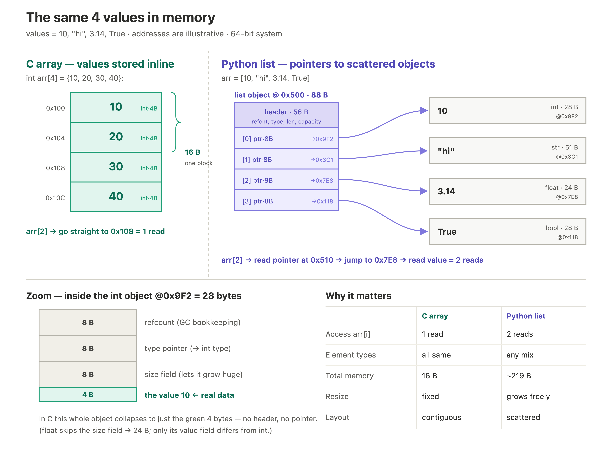

# Array

An array is a contiguous block of memory:
- In statically typed languages (C, Java, C++), an array is declared with a fixed type, so every slot must hold that type.
```c
int* arr = (int*)malloc(5 * sizeof(int));
```
This allocates space for 5 integers and stores a pointer to the first element in `arr`. Under the hood, the computer reserves 5 blocks of memory (4 bytes x 5) for the values, plus one more block (8 or 4 bytes) for the pointer itself.

- In dynamically typed languages (Python, JavaScript), an array stores pointers to objects rather than the objects themselves. Therefore, array in python (list) can store different type of values.
```python
arr = [1, 2, 3, 4, 5]
arr = [10, 'hi', 3.14, True]
```

## Static array vs dynamic array

**Static array** — fixed size, decided when created. It cannot grow or shrink. If you need more space, you must make a new array and copy everything over.

```c
int arr[5];   // size 5, fixed forever
```

**Dynamic array** — can grow as you add items. It still uses a contiguous block under the hood, but when it gets full, it automatically allocates a bigger block (usually 2x), copies the old items over, and frees the old one.

```python
arr = []          # starts empty
arr.append(1)     # grows automatically
arr.append(2)
```

Examples: Python `list`, Java `ArrayList`, C++ `std::vector`, Go `slice`.

**How growth works (capacity vs size):**
- `size` = how many items you have.
- `capacity` = how many slots are reserved.
- When `size` reaches `capacity`, it doubles the capacity, copies, and frees the old block.

| | Static array | Dynamic array |
|---|---|---|
| Size | fixed | grows/shrinks |
| Resize | manual (new array + copy) | automatic |
| Access `arr[i]` | O(1) | O(1) |
| Append | — | O(1) amortized* |
| Extra memory | none | some unused capacity |

\*Most appends are O(1). The occasional resize is O(n), but since it doubles each time, the average cost per append stays O(1) ("amortized").

### Example: C array vs Python list

A C array is a classic **static** array; a Python list is a **dynamic** array. They also differ in how they store data:



| | C array (static) | Python list (dynamic) |
|---|---|---|
| What each slot holds | the raw value | a *pointer* to an object elsewhere in memory |
| Access `arr[2]` | one read | two reads (read pointer → follow it to the object) |
| Per-element overhead | none (e.g. 4 bytes for an int) | object overhead — refcount, type, size (~28 bytes for an int) |
| Types | all items must be the same type | can mix types |
| Size | fixed | grows anytime |
| Memory management | manual — call `free()` or you leak | automatic (garbage collection) |
| Trade-off | fast and small, but strict | easy to use, but slower and uses more memory |

```c
// C — you free it yourself
int* arr = (int*)malloc(5 * sizeof(int));
// ... use arr ...
free(arr);   // forget this → memory leak
```

```python
# Python — freed automatically
arr = [1, 2, 3, 4, 5]
# ... use arr ...
# no free needed; garbage collector handles it
```