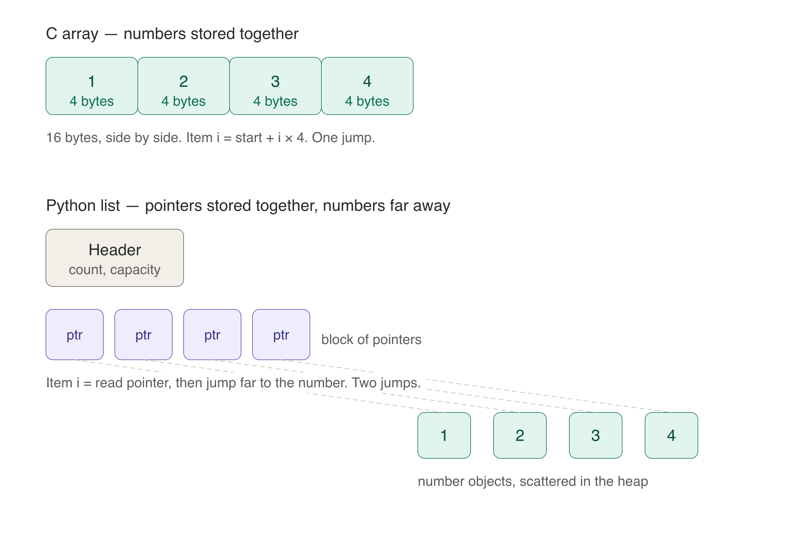

# Array

An array is a contiguous block of memory:
- In statically typed languages (C, Java, C++), an array is declared with a fixed type, so every slot must hold that type.
```c
int* arr = (int*)malloc(5 * sizeof(int));
```
This allocates space for 5 integers and stores a pointer to the first element in `arr`. Under the hood, the computer reserves 5 blocks of memory (4 bytes x 5) for the values, plus one more block (8 or 4 bytes) for the pointer itself.

- In dynamically typed languages (Python, JavaScript), an array stores pointers to objects rather than the objects themselves. Therefore, array in python (list) can store different type of values.
```python
arr = [1, 2, 3, 4, 5]
arr = [10, 'hi', 3.14, True]
```

## Static array vs dynamic array

**Static array** — fixed size, decided when created. It cannot grow or shrink. If you need more space, you must make a new array and copy everything over.

```c
int arr[5];   // size 5, fixed forever
```

**Dynamic array** — can grow as you add items. It still uses a contiguous block under the hood, but when it gets full, it automatically allocates a bigger block (usually 2x), copies the old items over, and frees the old one.

```python
arr = []          # starts empty
arr.append(1)     # grows automatically
arr.append(2)
```

Examples: Python `list`, Java `ArrayList`, C++ `std::vector`, Go `slice`.


### Example: C array vs Python list

**C array** keeps the numbers together.

int arr[4] = {1,2,3,4} is just 16 bytes, side by side. The numbers live right next to each other. To get item i, the computer does simple math: start + i × 4. One jump. Very fast.
**Python list** keeps pointers together, not numbers.

arr = [1,2,3,4] has a small header (counts, capacity) + a block of pointers. Each pointer points to a separate number object somewhere else in the heap. Multiple pointers can also point to same object. To get item i, the computer reads the pointer, then jumps far away to find the real number. Two jumps. Slower.




## Array Operations

Python `list` is a **dynamic array**. It always allocates extra more slots (capacity) than the current `len(list)`.
- **capacity**: number of slot are allocated for the list. 
- **size**: actual number of element in the list. **size** <= **capacity**
- **Growth factor**: ~2× in CPython (precisely: `new_capacity = old_capacity + (old_capacity >> 3) + (6 if old_capacity < 9 else 0)`).

| Operation | Code | Time Complexity |
|-----------|------|-----------------|
| Index access | `arr[i]` | O(1) |
| Append | `arr.append(x)` | O(1) amortized |
| Pop from end | `arr.pop()` | O(1) amortized|
| Insert | `arr.insert(i, x)` | O(n) |
| Delete | `del arr[i]` | O(n) |
| Search | `x in arr` | O(n) |
| Slice | `arr[i:j]` | O(k) |
| Length | `len(arr)` | O(1) |

**Index access** `arr[i]` — O(1)  
Direct pointer arithmetic. Bounds check only (raises `IndexError` if invalid).

**Append** `arr.append(x)` — O(1) *amortized*  
If `size == capacity`: allocate new block (~2×), copy all elements O(n), free memory of old block → O(n).  
Then store `x` at `arr[size]`, increment `size`. The rare resize cost averages to O(1) per append.

**Pop from end** `arr.pop()` — O(1) *amortized*  
Decrement `size`, return element. Optionally shrink `capacity // 2` when `size <= capacity // 4` (prevents thrashing).

**Insert** `arr.insert(i, x)` — O(n)  
If `size == capacity`: resize first. Shift elements `[i:]` right by one, write `x` at `i`, increment `size`.

**Delete** `del arr[i]` — O(n)  
Shift elements `[i+1:]` left by one, decrement `size`. Optionally shrink capacity (same threshold as pop).

**Search** `x in arr` — O(n)  
Linear scan; returns `True` on first match.

**Slice** `arr[i:j]` — O(k) where `k = j - i`  
Allocates new list of length `k`, copies references (pointers) from source range.

